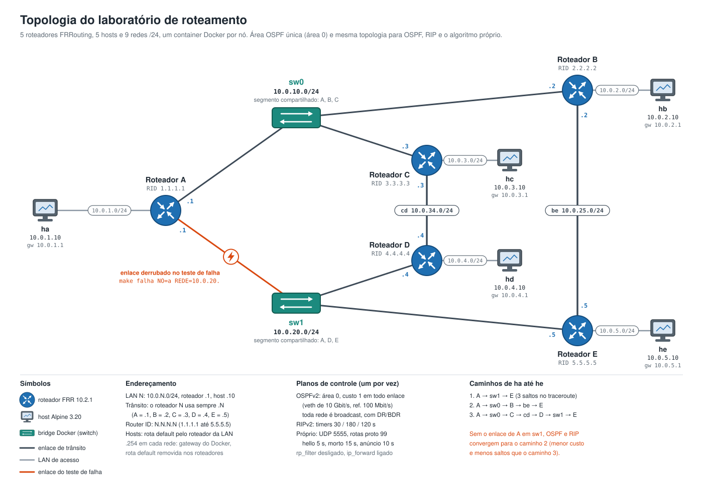

# Laboratório de roteamento: OSPF, RIP e algoritmo próprio

Trabalho do GA de Redes de Computadores: Internetworking, Roteamento e Transmissão (Unisinos, 2026/2).

Toda a infraestrutura é código: a topologia está em `docker-compose.yml`, as configurações dos
roteadores em `configs/`, e a operação, os testes e a coleta de métricas em `Makefile` e `scripts/`.
Quem clonar o repositório sobe a mesma rede com um comando.

- **Plataforma de roteamento:** [FRRouting](https://frrouting.org) 10.2.1, sucessor mantido do Quagga.
- **Protocolos comparados:** OSPFv2 e RIPv2, mais um algoritmo próprio (contratos em `algoritmo/`).
- **Virtualização:** containers Docker, um por roteador e um por host.

Os três planos de controle nunca rodam ao mesmo tempo: cada `make up PROTO=...` recria o laboratório do zero.

## Topologia

Cinco roteadores, cada um com uma LAN de acesso e um host, ligados por quatro redes de trânsito.
Dois segmentos compartilhados (`sw0` e `sw1`) fazem o papel de switches.



De A até E existem três caminhos: direto por `sw1`, por B (`sw0` e `be`) e por C e D (`sw0`, `cd` e `sw1`).
O enlace de A em `sw1` é o que os testes derrubam. Sem ele, OSPF e RIP passam a usar o caminho por B.

O diagrama é gerado por `python3 docs/topologia.py docs/topologia.svg`.

| Rede | Prefixo | Membros |
| ---- | ------- | ------- |
| LAN de A a E | `10.0.N.0/24`, N = 1 a 5 | roteador `.1`, host `.10` |
| sw0 | `10.0.10.0/24` | A `.1`, B `.2`, C `.3` |
| sw1 | `10.0.20.0/24` | A `.1`, D `.4`, E `.5` |
| be | `10.0.25.0/24` | B `.2`, E `.5` |
| cd | `10.0.34.0/24` | C `.3`, D `.4` |

Nas redes de trânsito o roteador N sempre usa o endereço `.N`. Router IDs: `1.1.1.1` (A) até `5.5.5.5` (E).
Os nomes das interfaces (`eth0` a `eth2`) dependem da ordem em que o Docker conecta as redes e mudam
entre execuções. Os scripts localizam a interface pelo prefixo (`scripts/lib.sh`), nunca pelo nome.

## Requisitos

- Docker com Compose v2 (testado com Docker Desktop 24.0.5 em macOS, arm64).
- `make` e `sh`. Nada de Python é necessário na máquina: os gráficos rodam em um container.

## Uso

```sh
make up PROTO=ospf        # sobe com OSPF (ou rip, ou proprio)
make verificar PROTO=ospf # critério de aceite: tabelas, 20 pares de ping, falha e retorno
make status               # tabelas de rotas dos 5 roteadores
make vizinhos NO=a        # vizinhos OSPF (ou estado RIP) de um roteador
make trace DE=ha PARA=10.0.5.10
make falha NO=a REDE=10.0.20.     # derruba o enlace de A em sw1
make restaura NO=a REDE=10.0.20.
make vtysh NO=a           # CLI do FRR, com a mesma sintaxe do IOS usado no Packet Tracer
make down
make help                 # todos os comandos
make demo                 # demonstração para o vídeo: OSPF, RIP e Gravidade em sequência, sem interação
```

O OSPF leva cerca de 50 s para convergir depois do `up`, por causa da espera de 40 s da eleição de DR
nos segmentos compartilhados. O RIP converge em poucos segundos.

## Métricas e gráficos

```sh
make metricas PROTO=ospf   # ~7 min por protocolo
make metricas PROTO=rip
make metricas PROTO=proprio
make graficos              # resultados/graficos/*.png e resumo.md
```

Todos os protocolos passam pelo mesmo cenário (`scripts/metricas.sh`):

| Métrica | Como é medida |
| ------- | ------------- |
| Convergência inicial | tempo do início dos containers até os 5 roteadores terem as 9 redes e `ha` alcançar `he` |
| Tamanho da tabela | rotas em `ip route` de cada roteador, total e aprendidas pelo protocolo |
| Tráfego de controle | `tcpdump -Q out` em cada roteador por 120 s em regime: pacotes, bytes, bit/s e pacotes/min |
| Delay | RTT de 20 pings de `ha` para `he`, e número de saltos no traceroute |
| Falha de enlace | ping contínuo de `ha` para `he` a cada 0,2 s; derruba A em `sw1`; mede o maior intervalo sem resposta, os pacotes perdidos e o tráfego de controle da reação |

### Cenário com atraso

Nos containers todos os enlaces têm a mesma latência, então uma métrica baseada em atraso não tem
o que medir. Com `ATRASO=1`, cada roteador aplica com `tc netem` o atraso de `configs/atrasos.conf`
nas redes de trânsito antes de subir o protocolo: 1 ms no `sw0`, 15 ms no `sw1`, 3 ms no `be` e 5 ms
no `cd` (ida; o RTT é o dobro). Os valores são proporcionais à distância, e o arquivo explica cada um.

```sh
make metricas PROTO=ospf ATRASO=1   # grava em resultados/atraso/<proto>/
make graficos ATRASO=1              # resultados/atraso/graficos/
make up PROTO=proprio ATRASO=1      # sobe o laboratório com atraso, para testes e o vídeo
```

De A até E, RIP e OSPF continuam usando o caminho direto por `sw1` (1 salto, 30 ms de RTT), e o
algoritmo próprio passa por B (2 saltos, cerca de 10 ms). Os resultados do cenário base não são afetados.

Os filtros de captura são `ip proto 89` (OSPF), `udp port 520` (RIP) e `udp port 5555` (algoritmo próprio).
Cada execução grava em `resultados/<proto>/`: `metricas.csv`, as tabelas de rotas, os pcaps e as saídas de ping e traceroute.
Os tempos podem ser ajustados por variável: `JANELA`, `FALHA_TOTAL`, `FALHA_APOS` e `CONV_MAX` (ver o cabeçalho do script).

## Algoritmo próprio

Os contratos estão em `algoritmo/` e a especificação em [`algoritmo/CONTRATO.md`](algoritmo/CONTRATO.md).
Ainda não há implementação: `make up PROTO=proprio` sobe os roteadores sem FRR e o agente encerra
informando isso. O algoritmo está pronto quando `make verificar PROTO=proprio` passar.

## Estrutura

```
docker-compose.yml     topologia física: 5 roteadores, 5 hosts, 9 redes
docker/                imagens do roteador, do host e da análise, e os entrypoints
configs/ospf/          FRR com OSPF: daemons e <no>.conf
configs/rip/           FRR com RIP: daemons e <no>.conf
configs/proprio/       parâmetros do algoritmo próprio: <no>.json
algoritmo/             contratos do algoritmo próprio (pacote Python)
scripts/               verificação, falha de enlace e coleta de métricas
analise/graficos.py    gráficos comparativos a partir dos CSV
docs/                  diagrama da topologia (topologia.svg) e o script que o gera
resultados/            saída das métricas (ignorado pelo git)
```

## Detalhes da infraestrutura

- **Rota default do Docker.** O Docker cria uma rota default pelo gateway de cada rede. Os entrypoints a
  removem nos roteadores e a trocam pelo roteador da LAN nos hosts, para que o único caminho entre as
  LANs seja o roteamento configurado. O gateway do Docker fica em `.254` para liberar o `.1`.
- **Redes não internas.** Com `internal: true` o Docker descarta no bridge pacotes com destino fora da
  sub-rede, o que bloqueia o multicast do OSPF e do RIP e todo tráfego roteado.
- **rp_filter desligado por interface.** Com caminhos alternativos, ida e volta podem seguir rotas
  diferentes, e o modo estrito descartaria esses pacotes.
- **Configurações somente leitura.** `configs/` é montado só leitura e copiado para `/etc/frr` ao
  iniciar, para que o FRR nunca altere o repositório.
